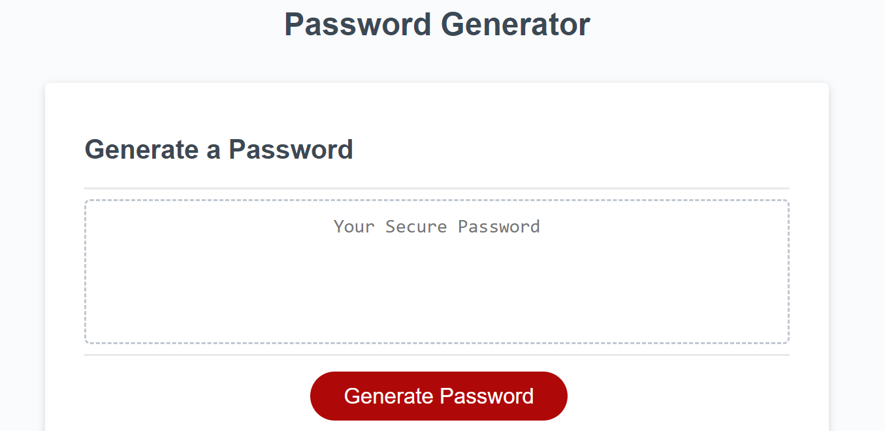
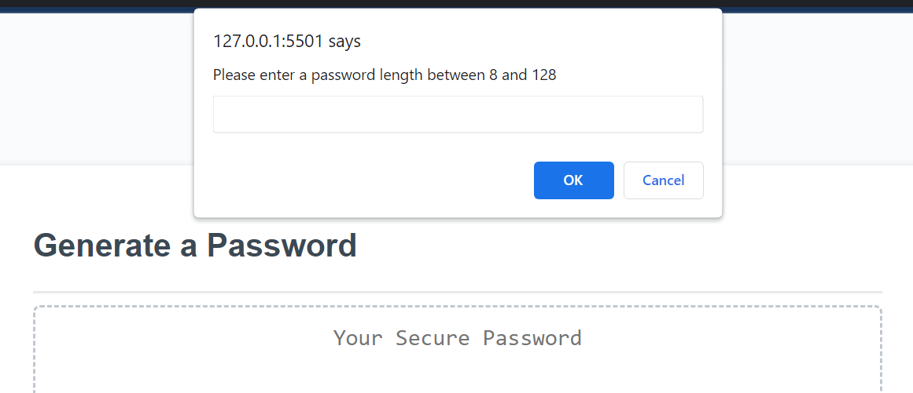
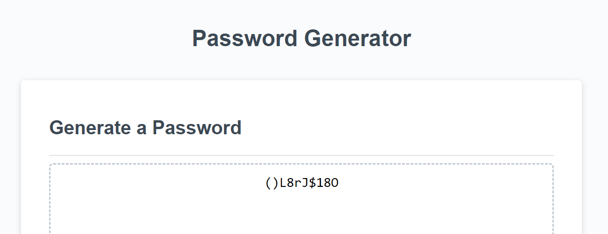

# 03-Password-Generator

## Description
This project was created to provide users with a tool to create passwords.
Additionally, creating a random password generator has helped me become more familiar with javascript.

## Installation
No installation needed, simply access the website on your favorite browser.

## Usage
In order to successfully use the password generator, follow the promps on the window pop ups.
The generator will create a random password based on your chosen preferences.

Link:https://volcomix13.github.io/03-Password-Generator/
GitHub:https://github.com/Volcomix13/03-Password-Generator

## Credits
-The Odin Project for tutorials on functions (https://www.theodinproject.com/paths/foundations/courses/foundations)
-Daniel Vega youtube tutorial (https://www.youtube.com/watch?v=CQb_48XMJo8)
-Conditional statements in javascript (https://www.youtube.com/watch?v=IsG4Xd6LlsM)

## License
Please see repository for information on license